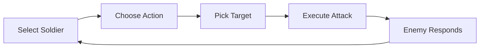

# Battle System

Cronos Army features strategic turn-based combat where every decision matters.

## How Battles Work

When you enter a battle, you face off against the defending army (or attackers, if you're defending). Combat alternates between sides until one team is eliminated.

### The Combat Loop

### Your Choices

**1. Select Soldier**
Choose which of your soldiers acts this turn. Consider:
- Current health
- Personality (affects special moves)
- Strategic position

**2. Choose Action**

<CardGroup cols={3}>
  <Card title="Attack" icon="sword">
    Full damage, no protection. Best when you can finish an enemy.
  </Card>
  <Card title="Defensive" icon="shield">
    Reduced damage dealt, but you take less damage too. Good when low on health.
  </Card>
  <Card title="Special" icon="star">
    Unique ability based on personality. Can turn the tide.
  </Card>
</CardGroup>

**3. Pick Target**
Select which enemy soldier to attack. Focus fire to eliminate threats quickly.

## Personality Specials

Every soldier personality has a unique special ability:

| Personality | Special | Effect |
|-------------|---------|--------|
| Aggressive | Piercing Strike | Ignores 50% of enemy defense |
| Intelligent | Analyze Weakness | +40% damage to target |
| Reckless | All-In | 2x damage, but take 50% more next turn |
| Defensive | Shield Wall | -60% damage taken this turn |
| Funny | Distract | Enemy has 30% miss chance next attack |
| Mysterious | Shadow Step | 40% chance to dodge next attack |
| Inspiring | Rally | Heal all allies for 15% |
| Stubborn | Last Stand | Can't die this turn (min 1 HP) |

## Defender AI

When you attack, enemy soldiers respond based on THEIR personalities:

- **Aggressive defenders** target your weakest soldier
- **Stubborn defenders** attack whoever hit them last
- **Intelligent defenders** focus the biggest threat
- **Defensive defenders** protect low-health allies

Understanding enemy patterns helps you predict their moves.

## Winning Battles

Eliminate all enemy soldiers to win. Rewards:
- Territory captured/defended
- 25 WPP (5 base + 20 victory bonus)
- CRO income from held territory

<Tip>
  Focus fire is usually the best strategy. A dead enemy deals no damage.
</Tip>
